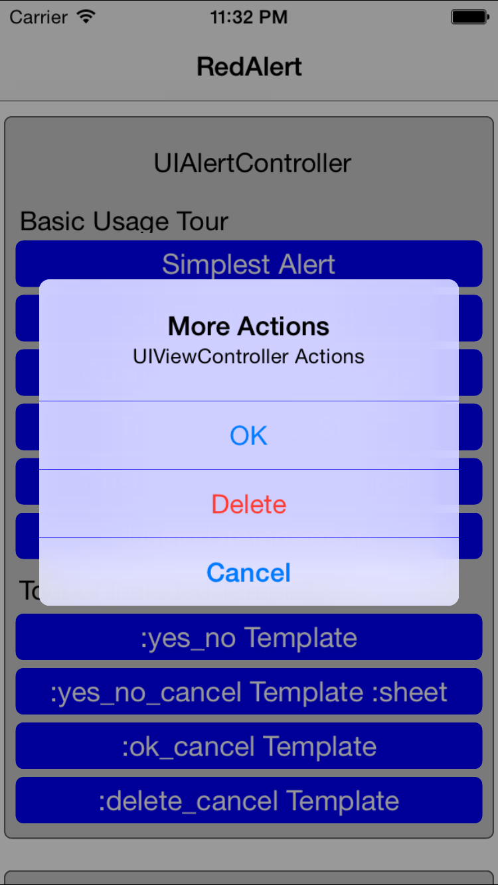

[](http://rubymotionquery.com)

# RedAlert
[](http://badge.fury.io/rb/RedAlert) [](https://travis-ci.org/GantMan/RedAlert) _Alerts and ActionSheets with ease_

### Did you know that UIAlertView and UIActionSheet (as well as their respective delegate protocols) are deprecated in iOS 8?

Apple requests you start using the new `UIAlertController`.  This gem is built on `UIAlertController` and RMQ, along with seemless support for antiquated `UIAlertView`s & `UIActionSheet`s for the gnostalgic.

With an emphasis on ease of use, this gem allows you to quickly implement Alerts and Actionsheets in your RMQ RubyMotion applications.

When run on iOS 8, RedAlert uses `UIAlertController` to present alerts and sheets.

When run on iOS 7, RedAlert uses `UIAlertView` present alerts and `UIActionSheet` to present sheets.

## Screenshot



## Installation

**Requires RMQ 1.2.0 or later, and iOS 7 or later**

Add the **RedAlert** gem to your Gemfile.
```ruby
  gem 'RedAlert'
```

## Usage
**Note:  If you're using [RedPotion](https://github.com/infinitered/redpotion) then `rmq.app` can be accessed by simply typing `app`, so `rmq.app.alert` would be simply `app.alert`.  The following examples are verbose and assume only [RMQ](https://github.com/infinitered/rmq).**

```ruby

  # Simply do an alert
  rmq.app.alert("Minimal Alert")

  # Alert with callback
  rmq.app.alert("Alert with Block") {
    puts "Alert with Block worked!"
  }

  # Modify some snazzy options
  rmq.app.alert(title: "New Title", message: "Great message", animated: false)

  # Switch it to look like an ActionSheet by setting the style
  rmq.app.alert(title: "Hey there!", message: "My style is :sheet", style: :sheet) do |action_type|
    puts "You clicked #{action_type}"
  end

  # Utilize common templates
  rmq.app.alert(message: "Would you like a sandwich?", actions: :yes_no_cancel, style: :sheet) do |action_type|
    case action_type
    when :yes
      puts "Here's your Sandwich!"
    when :no
      puts "FINE!"
    end
  end
```

You can even use the `make_button` helper to create custom UIAction buttons to add:
```ruby
  # Use custom UIAction buttons and add them
  taco = rmq.app.make_button("Taco") {
            puts "Taco pressed"
          }
  nacho = rmq.app.make_button(title: "Nacho", style: :destructive)  {
            puts "Nacho pressed"
          }
  button_list = [taco, nacho]
  rmq.app.alert(title: "Actions!", message: "Actions created with `make_button` helper.", actions: button_list)
```

## Available Templates

Templates are provided [HERE](https://github.com/GantMan/RedAlert/blob/master/lib/project/button_templates.rb)
* `:yes_no` = Simple yes and no buttons.
* `:yes_no_cancel` = Yes/no buttons with a separated cancel button.
* `:ok_cancel` = OK button with a separated cancel button.
* `:delete_cancel` = Delete button (red) with a separated cancel button.

_More to come:_ be sure to submit a pull-request with your button template needs.


## iOS 7 Support

If you still need iOS 7, RedAlert has your back.

Instead of using iOS 8's UIAlertController, RedAlert will use UIActionSheet to display your sheets and
UIAlertView to display your views.

**With little-to-no changes to your code.**

Because capabilities of iOS 7 & 8 alert-components are different, just a few edge cases that might sting you:

* `UIAlertView` doesn't have the concept of :destructive buttons.  These will fall back to :default.
* `UIAlertView` cares about the order of your `:cancel` actions, so `[:ok, :cancel]` is shown different than `[:cancel, :ok]`.
* `UIActionSheet` also cares about the order.  It's possible to put a `:cancel` first, which looks slightly awkward when shown.  Try to put `:cancel` last.
* `UIAlertView`'s `alertViewStyles` are not available through RedAlert as they aren't compatible with iOS 8.  You'll have to call that directly.


## More info

**i18n support by [Mark Rickert](https://github.com/GantMan/RedAlert/pull/2)**
**iOS 7 support by Steve Kellock**

Feel free to read up on UIAlertController to see what all is wrapped up in this gem.
* [Hayageek](http://hayageek.com/uialertcontroller-example-ios/)
* [NSHipster](http://nshipster.com/uialertcontroller/)


## Contributing

1. Fork it
2. Create your feature branch (`git checkout -b my-new-feature`)
3. Commit your changes (`git commit -am 'Add some feature'`)
4. Push to the branch (`git push origin my-new-feature`)
5. Create new Pull Request
